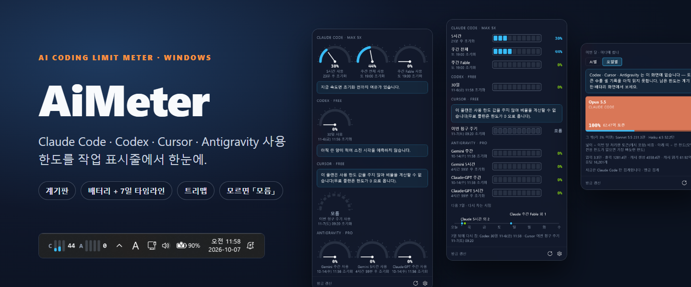
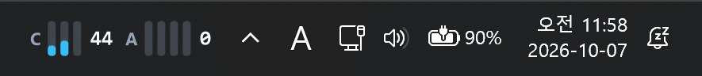
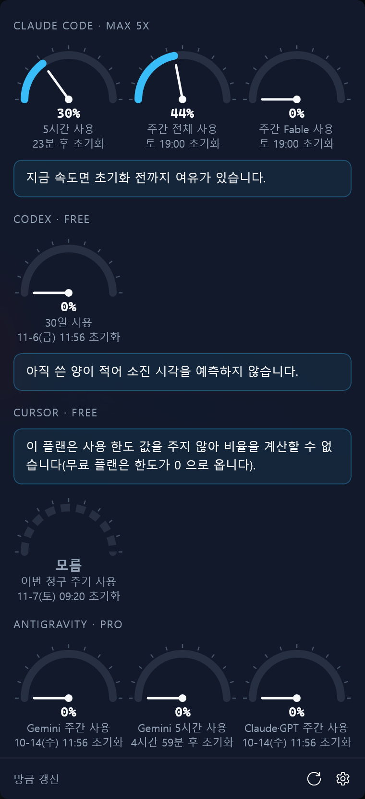
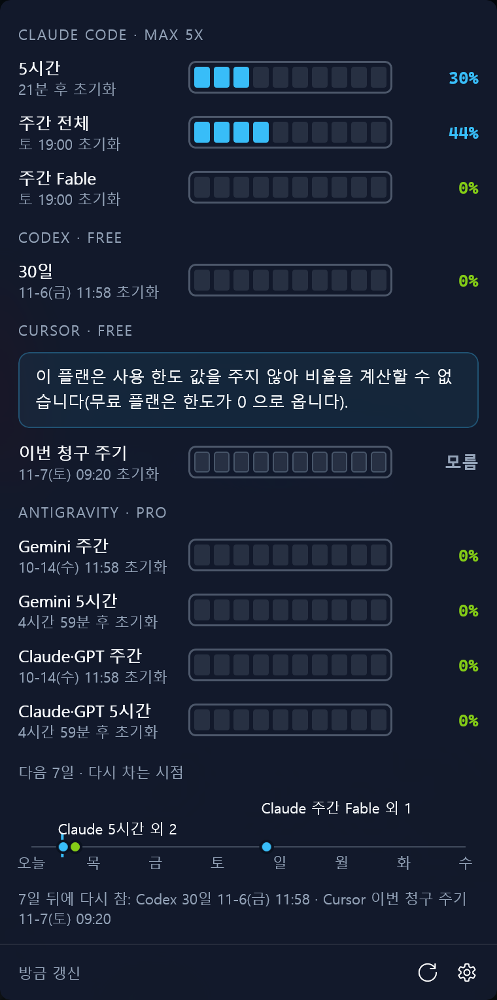
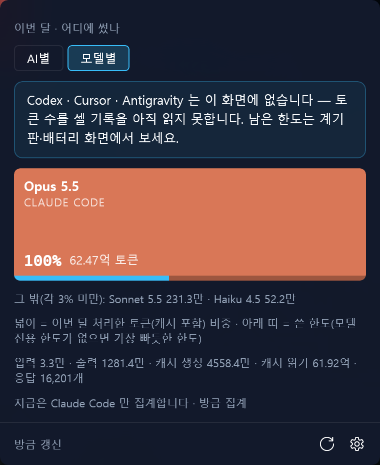
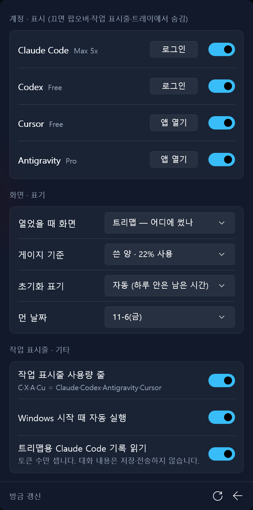
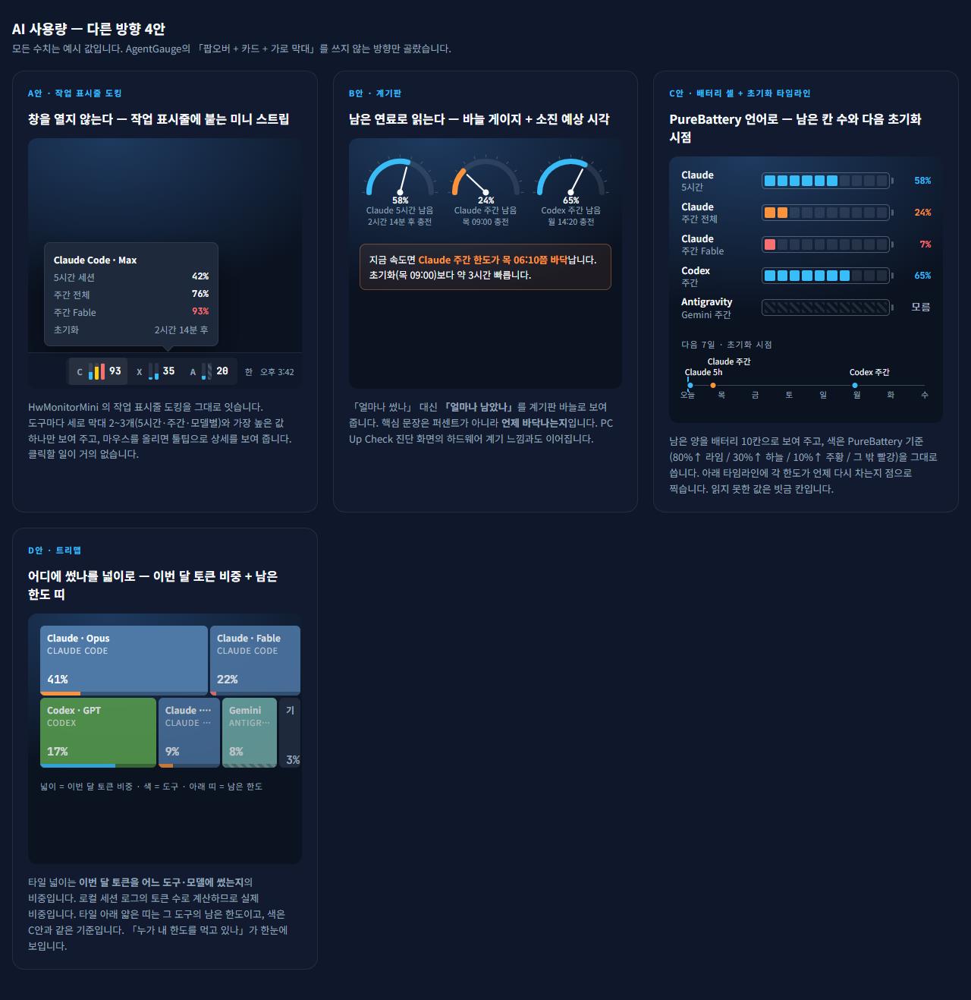

# AiMeter

**AI 코딩 도구를 쓰다가 「한도가 얼마나 남았지?」 싶을 때, 작업 표시줄만 보면 되게 만든 Windows 앱입니다.**

Claude Code · Codex · Cursor · Antigravity 의 사용 한도가 **얼마나 남았는지**, **언제 다시 차는지**를 작업 표시줄의 작은 줄과 트레이 아이콘, 누르면 열리는 팝오버로 보여 줍니다.
값을 모를 때는 0% 로 꾸며 보여 주지 않고 솔직하게 **「모름」**이라고 표시합니다.

> [AgentGauge](https://github.com/ghostface2232/AgentGauge) 를 벤치마킹해 만들었습니다(코드는 새로 작성).
> PC Up Check([pcupcheck.com/aimeter](https://pcupcheck.com/aimeter)) 도구 모음의 하나입니다.

**⬇️ [최신 버전 받기 (GitHub Releases)](https://github.com/vwac90-netizen/AiMeter/releases/latest)**

---

## 화면

작업 표시줄 시계 옆에 이렇게 붙습니다. 글자는 도구(C Claude · X Codex · A Antigravity · Cu Cursor), 막대는 한도, 숫자는 남은 양(또는 쓴 양)입니다.



줄이나 트레이의 링 아이콘을 누르면 팝오버가 열립니다. 화면은 세 가지 중 **마음에 드는 하나**를 골라 씁니다.

| 계기판 — 언제 바닥나나 | 배터리 — 언제 다시 차나 | 트리맵 — 어디에 썼나 |
| :---: | :---: | :---: |
|  |  |  |
| 한도마다 바늘 게이지. 지금 속도라면 언제 바닥나는지 한 문장으로 알려 줍니다. | 남은 양을 10칸 배터리로, 아래에는 다음 7일 동안 다시 차는 시점을 타임라인으로. | 이번 달 토큰을 어떤 모델에 썼는지 넓이로. (Claude Code 기록 기준, 켜야 동작) |

설정은 톱니바퀴 하나로 끝납니다.



## 이런 걸 할 수 있어요

- **4가지 도구를 한곳에서** — Claude Code(5시간 · 주간 · 모델별 주간), Codex(플랜이 주는 창, 예: 무료 30일), Cursor(이번 청구 주기), Antigravity(Gemini · Claude/GPT 의 5시간 · 주간).
- **작업 표시줄 줄이 알아서 크기를 맞춥니다** — 자리가 넉넉하면 한도마다 막대를, 앱 버튼이 많아 자리가 모자라면 막대 하나나 숫자만 그려서 **앱 버튼을 덮지 않습니다.**
- **게이지 기준을 고를 수 있어요** — 「남은 양」(78% 남음) 또는 「쓴 양」(22% 사용). 팝오버 · 작업 표시줄 · 트레이 아이콘이 모두 같은 기준을 따릅니다. 색은 어느 쪽이든 남은 양이 적을수록 주황 → 빨강.
- **시간 표기도 취향대로** — 초기화를 「1시간 34분 후」 / 「토 19:00」 / 둘 다, 먼 날짜를 「11-6(금)」 / 「11월 6일(금)」.
- **필요 없는 도구는 숨기기** — 무료 플랜이라 볼 게 없는 도구는 스위치 하나로 모든 화면에서 뺍니다.
- **소진 예측** — 지금 속도가 이어지면 초기화 전에 바닥나는지 알려 줍니다. 쓴 양이 너무 적을 때는 억지로 예측하지 않습니다.
- **Antigravity 는 앱이 꺼져 있어도** 읽습니다(설치된 엔진을 잠깐 띄워 묻고 바로 끕니다).
- Windows 시작 때 자동 실행 · 한국어/영어 화면(Windows 표시 언어를 따름).

## 필요한 것

- Windows 10 · 11, **x64** PC (Windows 11 에서 확인했습니다)
- 보고 싶은 도구가 설치돼 있고 **로그인돼 있을 것** — Claude Code CLI · Codex CLI · Cursor 앱 · Antigravity 앱
- .NET 설치는 필요 없습니다(실행에 필요한 런타임이 zip 안에 들어 있어요).

## 시작하기

1. [Releases](https://github.com/vwac90-netizen/AiMeter/releases/latest) 에서 `AiMeter-<버전>-win-x64.zip` 을 받습니다(약 84MB).
2. 원하는 폴더(예: `%LOCALAPPDATA%\Programs\AiMeter`)에 압축을 풀고 `AiMeter.exe` 를 실행합니다. 설치 과정은 없습니다.
3. 트레이(^)에 링 아이콘이, 작업 표시줄 시계 옆에 사용량 줄이 생깁니다. **누르면 팝오버가 열려요.**
4. 로그인이 필요한 도구는 팝오버의 톱니바퀴 → **「로그인」** 버튼을 누르면 그 도구의 공식 로그인 창이 열립니다. 마치고 새로고침(⟳)을 누르세요.

AiMeter 에는 따로 큰 창이 없습니다. 끄려면 트레이 아이콘을 오른쪽 클릭 → **「끝내기」**.

### ⚠️ 처음 실행할 때 Windows 가 막을 수 있어요

개인이 비영리로 만든 앱이라 아직 **코드 서명이 없습니다.**

- **스마트 앱 제어**가 켜진 PC 에서는 Windows 가 실행을 막습니다. 끄는 것은 권하지 않습니다(Windows 버전에 따라 다시 켜려면 재설치가 필요할 수 있어요). 걱정되면 아래 「직접 빌드」로 만들어 쓰셔도 됩니다.
- 그 밖의 PC 에서는 「Windows의 PC 보호」 파란 창이 뜰 수 있어요 → **「추가 정보」 → 「실행」**.
- 받은 파일이 맞는지는 릴리스 노트의 **SHA-256** 과 비교해 확인할 수 있습니다.
  ```powershell
  Get-FileHash .\AiMeter-0.1.9-win-x64.zip -Algorithm SHA256
  ```

## 로그인 정보와 데이터

AiMeter 는 **스스로 로그인하지 않고, 토큰을 새로 받거나 고치지도 않습니다.** 각 도구가 이 PC 에 이미 저장해 둔 로그인을 **읽기 전용**으로 쓰고, 그 도구가 쓰는 사용량 주소에만 물어봅니다.

| 도구 | 읽는 곳 | 로그인하는 방법 |
| :--- | :--- | :--- |
| Claude Code | `%USERPROFILE%\.claude\.credentials.json` | `claude auth login` (설정의 「로그인」 버튼) |
| Codex | `%CODEX_HOME%\auth.json` 또는 `%USERPROFILE%\.codex\auth.json` | `codex login` (설정의 「로그인」 버튼) |
| Cursor | `%APPDATA%\Cursor\User\globalStorage\state.vscdb` (읽기 전용) | Cursor 앱에서 로그인 |
| Antigravity | 읽는 로그인 파일 없음 — 이 PC 안의 Antigravity 엔진(127.0.0.1)에 묻습니다 | Antigravity 앱에서 로그인 |

- 토큰 · 계정 정보는 **저장 · 기록 · 전송하지 않습니다.** 디스크(`%APPDATA%\AiMeter\`)에 남는 것은 화면에 보이는 사용률 · 초기화 시각 · 플랜 이름과 설정뿐입니다.
- Claude 사용량은 서버 부담을 줄이려고 **5분에 한 번**만 묻습니다(새로고침 버튼은 1분).
- 트리맵은 **켜야만**(기본 꺼짐) `%USERPROFILE%\.claude\projects` 기록에서 **토큰 수만** 셉니다. 대화 내용은 저장 · 전송하지 않아요.

## 지금의 한계

- 사용량 주소들은 각 회사가 **공개 문서로 약속한 API 가 아닙니다.** 바뀌면 값이 안 보일 수 있고, 그때는 「모름」과 안내 문구로 알려 줍니다.
- Cursor **무료 플랜**은 한도 값을 주지 않아 늘 「모름」입니다.
- 트리맵은 지금 **Claude Code 기록만** 셉니다(다른 도구는 화면에 「없다」고 적어 둡니다).
- 코드 서명 없음 · 자동 업데이트 없음(새 버전은 Releases 에서 받아 덮어쓰기) · x64 만.
- 로그인 토큰이 만료되면 그 도구에서 다시 로그인해야 합니다(AiMeter 가 토큰을 갱신하지 않기 때문).

## 지우기

설정에서 「Windows 시작 때 자동 실행」을 끄고 → 트레이 메뉴 「끝내기」 → 압축을 푼 폴더와 `%APPDATA%\AiMeter` 폴더를 지우면 끝입니다.

## 직접 빌드

[.NET 10 SDK](https://dotnet.microsoft.com/download) 가 필요합니다.

```powershell
git clone https://github.com/vwac90-netizen/AiMeter.git
cd AiMeter
dotnet publish -c Release -r win-x64 -o out
.\out\AiMeter.exe
```

스택: .NET 10 · WinUI 3 (Windows App SDK, unpackaged · self-contained) · H.NotifyIcon.WinUI · System.Management.
코드 주석의 `[Part N]` 은 원 개발 기록(PC Up Check 저장소)의 항목 번호입니다.

## 디자인 이야기

처음에는 네 가지 방향을 시안으로 그려 보고 골랐습니다. 지금 앱은 **A(작업 표시줄 줄)** 를 기본으로 두고, 팝오버에서 **B(계기판) · C(배터리 + 타임라인) · D(트리맵)** 중 하나를 골라 쓰는 구조입니다. (시안의 값은 모두 예시입니다.)



## 벤치마킹 · 감사

- **[AgentGauge](https://github.com/ghostface2232/AgentGauge)** 를 벤치마킹했습니다 — 공식 CLI 의 로그인을 읽기 전용으로 쓰고 사용량 주소에 묻는 방식, 도구별 한도 표시, Antigravity 엔진에 묻는 방법 등을 참고했습니다. 코드는 가져오지 않고 새로 작성했습니다.
- Claude · Claude Code 는 Anthropic, Codex · ChatGPT 는 OpenAI, Cursor 는 Anysphere, Antigravity · Gemini 는 Google 의 상표입니다. AiMeter 는 이 회사들과 관계없는 개인 프로젝트입니다.

## 라이선스

[MIT](LICENSE)

---

## English summary

**AiMeter** is a Windows app that shows how much of your **Claude Code, Codex, Cursor and Antigravity** usage limits is left — and when they refill — on a small taskbar strip, a tray ring icon and a popup (pick one view: **gauges**, **battery + 7-day refill timeline**, or a **monthly token treemap**). Unknown values are shown as "unknown", never faked as 0%. Benchmarked on [AgentGauge](https://github.com/ghostface2232/AgentGauge); code written from scratch.

- **Download**: [latest release](https://github.com/vwac90-netizen/AiMeter/releases/latest) → extract → run `AiMeter.exe` (self-contained, no .NET install; Windows 10/11 x64, verified on Windows 11).
- **Not code-signed yet**: Smart App Control blocks it; SmartScreen may warn ("More info" → "Run anyway"). Each release lists the zip's SHA-256. You can also build it yourself with the .NET 10 SDK.
- **Privacy**: it reuses the sign-in each tool already stored on your PC (read-only) and calls only the usage endpoint that tool itself uses. Tokens are never stored, logged or sent. These endpoints are not documented public APIs and may change.
- The taskbar strip measures your taskbar's app buttons and shrinks itself (fewer bars → numbers only) so it never covers them.
- Not affiliated with Anthropic, OpenAI, Anysphere or Google. MIT licensed.
